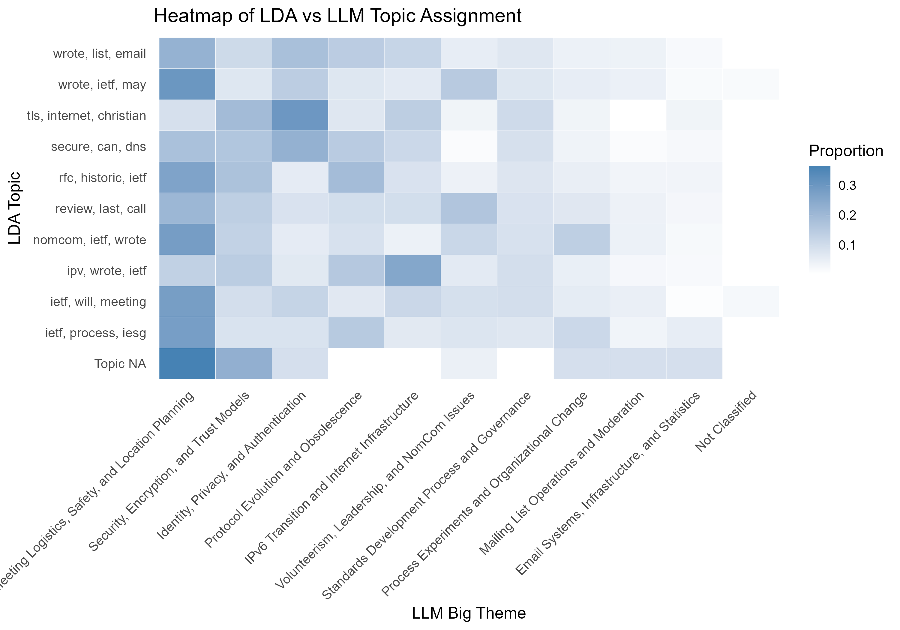
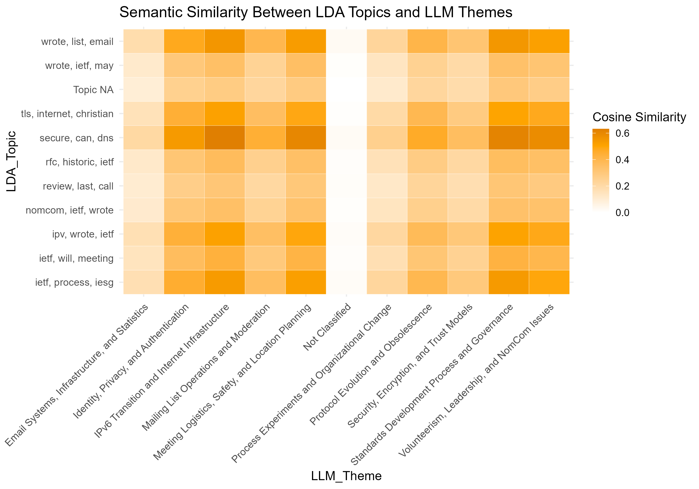
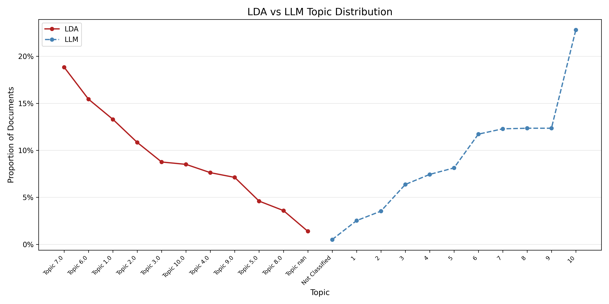

# Topic Modeling in Conversational Data: A Comparison of LDA and LLM-based Approaches

We don’t just work now - we message. Whether it's Slack threads, or email lists, most collaboration today happens in text. But those texts are messy with an overwhelming amounts, and ideas all mashed together. If you're building a classifier to summarize these conversations, you might reach for a tried-and-true method like Latent Dirichlet Allocation (LDA). But today, large language models (LLMs) offer an alternative — and they might just be winning.

To explore this, we analyzed 1,587 messages from the **main mailing list of the Internet Engineering Task Force (IETF)** — the international standards organization behind protocols like HTTP, DNS, and SMTP. These messages span a full year leading up to May 2025, real-time conversations on technical proposals, organizational governance, and meeting logistics. Unlike older or proprietary datasets (like the Enron corpus), the IETF archive is continuously updated and publicly accessible, making it a perfect snapshot of how modern technical teams communicate.

The goal was to compare how LDA and LLM-based approaches classify these messages into thematic clusters, and more importantly, which method better captures what’s really being said.

  
*Proportion of documents assigned to each LDA topic (y-axis) and LLM theme (x-axis). The email distribution seem to be forcibly divided in average by LDA classifier, rather than being naturally clustered around actual meanings like LLM.*

In the proportion heatmap above, blank spots indicate missing mappings and LDA missed several of the LLM’s themes entirely. These gaps reflect *conceptual blind spots* in the LDA model. Where LDA failed to identify even one topic, the LLM confidently grouped dozens of messages under coherent thematic umbrellas. This reinforces the idea that LLMs are better at recognizing higher-order structure in language — such as intent, context, and subjectivity — which LDA is blind to.

  
*Cosine similarity between LDA and LLM topic vectors based on message body text. The LLM classifier shows more focused and meaningful thematic groupings.*

The figure above reveals a striking pattern: multiple LDA topics clustered around a single LLM theme — particularly *"IPv6 Transition and Internet Infrastructure"*. This tells us that LDA may be over-fragmenting: splitting up similar discussions into several near-duplicate topics based solely on word co-occurrence. The same theme — say, “ietf”, “ipv6”, “wrote” — gets sliced into multiple low-coherence clusters.

Meanwhile, LLM themes like *“Security, Encryption, and Trust Models”* or *“Volunteerism and Leadership”* didn’t match well with any LDA topic at all. This is concerning. These themes aren’t minor; they reflect whole areas of discussion that LDA simply failed to capture.

To go further, we applied a many-to-one greedy mapping, matching each LDA topic to its most semantically similar LLM theme. The result is summarized below:

| LDA Topic                | LLM Theme                                      | Similarity |
|--------------------------|-----------------------------------------------|------------|
| ietf, process, iesg      | Standards Development Process and Governance  | 0.540      |
| ietf, will, meeting      | IPv6 Transition and Internet Infrastructure   | 0.430      |
| ipv, wrote, ietf         | IPv6 Transition and Internet Infrastructure   | 0.513      |
| nomcom, ietf, wrote      | IPv6 Transition and Internet Infrastructure   | 0.345      |
| review, last, call       | Standards Development Process and Governance  | 0.313      |
| rfc, historic, ietf      | IPv6 Transition and Internet Infrastructure   | 0.366      |
| secure, can, dns         | IPv6 Transition and Internet Infrastructure   | 0.632      |
| tls, internet, christian | IPv6 Transition and Internet Infrastructure   | 0.512      |
| Topic NA                 | Standards Development Process and Governance  | 0.299      |
| wrote, ietf, may         | Meeting Logistics, Safety, and Location       | 0.350      |
| wrote, list, email       | IPv6 Transition and Internet Infrastructure   | 0.552      |

Most LDA topics collapsed onto just a few LLM themes — especially “IPv6 Transition and Internet Infrastructure” — while many LLM-generated categories went unmatched. This imbalance highlights that **LDA is more suspicious** here: prone to redundancy, fragmentation, and coverage gaps.

So which should we trust? In this case, the **LLM themes are more credible**. They're not just smarter guesses. LLM classifiers are backed by better semantic consistency, broader coverage, and ability to group ideas, not just words. LDA, in contrast, appears to be missing the forest for the trees.

There are still caveats. LLM outputs depend heavily on prompting, and can be inconsistent or overconfident in labeling. But in this head-to-head, the evidence suggests that when it comes to classifying complex discussions, **LLMs aren’t just keeping up. They’re leading the conversation.**

*Source data: [IETF Mail Archive](https://mailarchive.ietf.org/arch/)*
=======

  
*Figure 1. The solid red line shows the proportion of documents assigned to each LDA topic, and the dashed blue line shows the proportion assigned to each LLM-derived theme. And there are documents not classified by both methods, which is shown in the center of the plot. The LDA curve is relatively smooth and flat while the LLM curve fluctuates more dramatically between different topics. This suggests that LLM may capture a wider variety of themes, but LDA distributes document assignments more evenly. *

1. Our chart keeps the design simple by minimizing visual clutter and using only essential elements like lines and points.
2. We arranged the topics in a V-shape: LDA topics are ordered from high to low, LLM topics are ordered from low to high, and they meet at a shared "Not Classified" point in the center to connect the two parts clearly.
3. We used two different but soft colors to separate LDA and LLM results, making them easy to differeniate without being distracting.
4. We connected the points with lines to make trends easy to follow and highlight the structural difference between LDA and LLM topic distributions.
5. We used the same axis scales and clear labels so that it’s easy to compare the proportions across methods at a glance.
